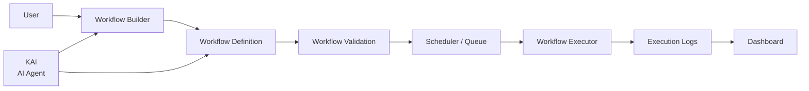
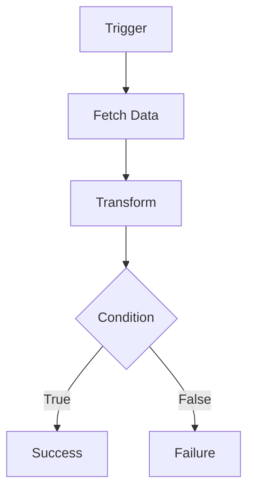

# Kairo

**Kairo is a visual workflow automation platform and job scheduler designed to make building and running automations simple.**

It provides an interactive drag-and-drop workflow editor where users can create, configure, schedule, validate, and execute workflows while a scalable backend handles workflow execution and background jobs.

<p align="center">
  
  
</p>


---

## KAI — AI Agent

**KAI** is the AI agent inside Kairo.

Instead of manually creating every step of a workflow, you can simply describe what you want KAI to do in natural language.

For example:

> "Every Monday at 9 AM, fetch my latest GitHub issues and send a summary to Slack."

KAI can interpret the request and help turn it into an executable workflow.

The goal is to make workflow automation **instruction-driven rather than configuration-heavy**.

---

## Features

### Workflow Builder

* Visual drag-and-drop workflow editor
* Interactive node and edge management with React Flow
* Workflow validation before execution
* Real-time workflow updates
* Automatic workflow saving
* Flexible workflow configuration

### Workflow Management

* Create, update, and delete workflows
* Execution logs
* Workflow state management

### Scheduling & Automation

* Job scheduling
* Background workflow execution
* Queue-based processing
* Retry mechanisms(on demand)
* Workflow execution tracking

### Authentication & Security

* JWT-based authentication
* Secure login and signup flows
* Password hashing with bcrypt
* Protected routes and APIs
* User-level workflow isolation


---

## How Kairo Works

Kairo follows a simple pipeline:



Users visually build a workflow, Kairo validates the workflow graph, schedules or queues the job, and the executor processes the workflow step-by-step.

---

## Workflow Execution

Workflows are represented as **directed graphs** consisting of nodes and edges.

Each node represents an operation, while edges define how execution moves between nodes.

Example:



The executor traverses this graph and executes nodes according to the workflow definition.

---

## Algorithms & Data Structures

Kairo uses several core concepts for workflow management and execution:

* **Directed Graphs** — workflows are represented as nodes and edges
* **Graph Traversal** — used to determine execution flow
* **Execution Trees** — used for branching and conditional execution strategies
* **Queues** — used for background job processing
* **Node & Edge Graph Management** — powered by React Flow

These concepts allow Kairo to model complex automation pipelines while keeping workflow execution structured and predictable.

---

## Tech Stack

| Category | Technologies |
|---|---|
| **Frontend** | Next.js, TypeScript, React, React Flow, Zustand, TanStack Query, Zod, Axios, TailwindCSS, Recharts |
| **Backend** | Node.js, Express.js, Prisma ORM |
| **Database** | PostgreSQL, Supabase |
| **Authentication & Security** | JWT, bcrypt |
| **Infrastructure** | Docker |
| **Testing** | Unit Testing, Playwright E2E Testing |

---

## Project Structure

```text
kairo/
│
├── backend/        # Express server, controllers, routes, models
│── frontend/       # React + React Flow UI
│── README.md
└── ...
```

---

## Getting Started

### Prerequisites

```
* Node.js
* bun or npm 
* PostgreSQL / Supabase
* Git
* Docker (optional)
```

### Clone the Repository

```bash
git clone https://github.com/exorcist09/kairo-v2.git
cd kairo-v2
```

### Install Dependencies

```bash
bun install
```

### Environment Variables

#### Backend

```env
PORT=5000

DATABASE_URL = your_postgresql_connection_string

JWT_SECRET = your_secret_key

SENTRY_DSN = your_sentry_dsn
```

#### Frontend

```env
NEXT_PUBLIC_API_URL = http://localhost:5000
```

### Run the Application

#### Start Backend

```bash
cd backend
bun run dev 
```

#### Start Frontend

```bash
cd frontend
bun run dev
```

---


## Why Kairo?

Traditional automation tools often require users to manually configure every step.

Kairo combines:

**Visual workflows + scheduling + execution infrastructure + AI**

to create a system where users can either build workflows visually or describe what they want and let **KAI** help construct the automation.

---

## License

This project is currently under development.
